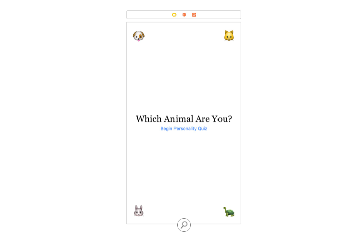
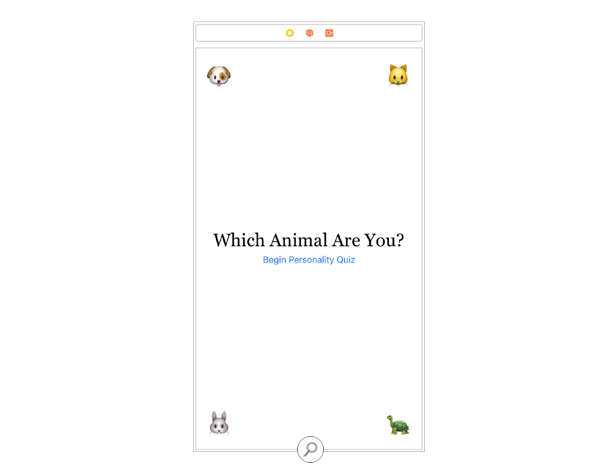
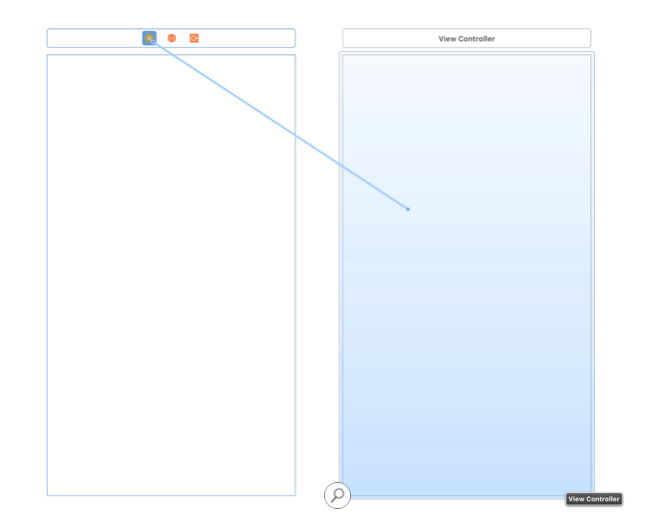
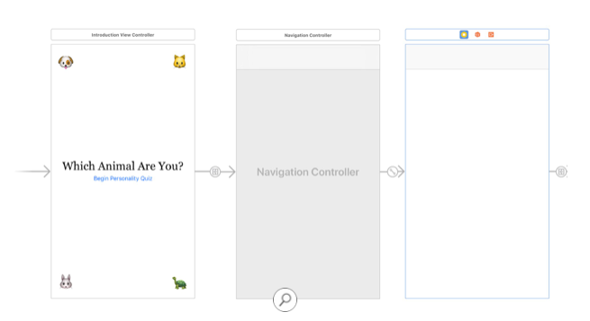
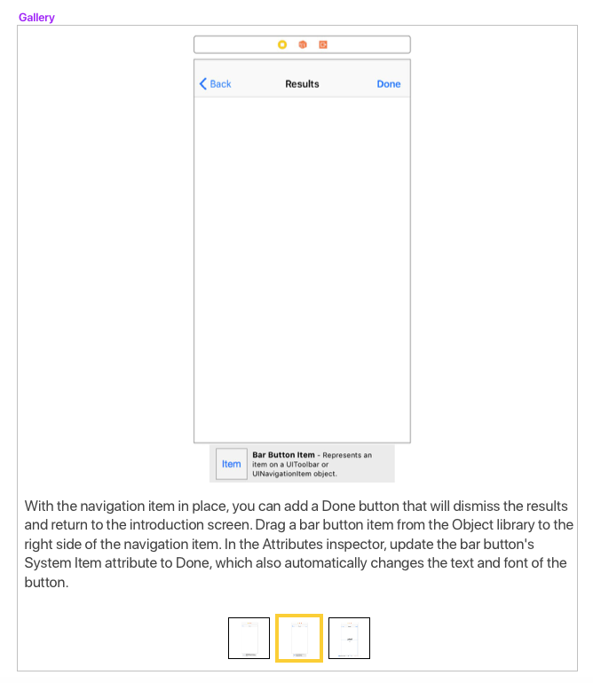
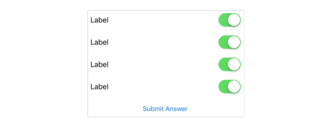
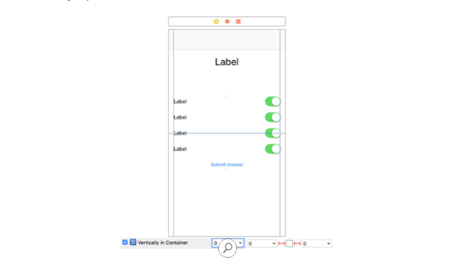
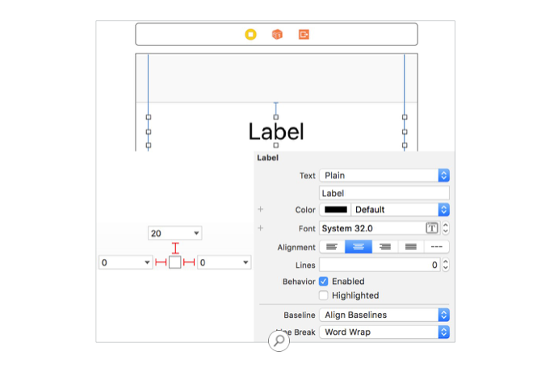
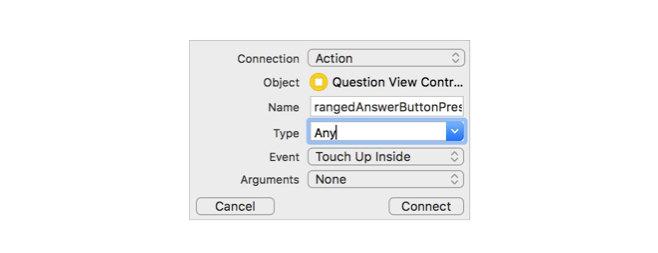

# Guided Project: Personality Quiz

  
In this unit, you learned about the UIKit framework and its controls. You also learned how to manage the position and size of views and controls using Auto Layout and stack views, while managing the flow of your app using navigation and tab controllers. Now you'll combine all that knowledge to build an app.

For this guided project, you'll create a personality quiz. Maybe you've seen this type of game before. Players are presented with a light-hearted topic and answer questions that align them to a particular outcome. Here are some examples of personality quiz topics: 

1. What animal are you? 
2. What country should you visit next? 
3. Which Apple product are you? 

There are no correct answers to quiz questions. Answers are purely subjective, and their results don't even have to be logical. For example, suppose you design a quiz called "What country should you visit next?" You could pose the question "What is your favorite color?" and decide that the answer "green" aligns to Italy and not to France. Other questions and answers might make more sense. If the player prefers sushi over pasta, you could award points for Japan instead of for Italy. 

This guided project will use "Which animal are you?" as the quiz topic. The four possible outcomes are: dog, cat, rabbit, and turtle. But if you prefer to choose your own topic and outcomes, go ahead. As long as you're following the steps in the project, any topic is fine. You'll learn more if you're having a good time. 

## Part One—Project Planning 

Rather than diving directly into Interface Builder or Swift, it's important to think about the goals and requirements of your personality quiz. Who's your target audience? Maybe you have a topic in mind, but what features will the quiz include? What models and views will you need to accomplish those features? 

「If you try to dig into writing code before you've thought through those questions, you'll probably end up rewriting or throwing away a lot of work. Spend some time now to plan your project and consider how best to approach it. 」

### Features

「What features are required to produce a fun personality quiz? Since this is probably your first app of this type, keep the list short. At a minimum, the app should accomplish three main goals: 」

1. Introduce the player to the quiz.
2. Present questions and answers
3. Display the results.

### Workflow

「With those three goals in mind, try to imagine your app as a series of related views. Each feature is very distinct from the other two, so each deserves its own screen. Some type of input will move the player from one feature to the next. For example, you can include a "Begin Quiz" button to move the player from the introduction to the questions, and answering the final question can transition to displaying the results. For the purposes of this project, you'll need at least three view controllers—one to present each of the three features. 」

「Did you also think about presenting a new view controller for each question? That's not actually necessary. In earlier lessons, you learned about two methods of presenting view controllers—modally or with a push onto a navigation stack. A modally presented screen typically includes a way to be dismissed, and any new view controller you push on a navigation controller has a Back button in the upper-left corner. In either case, there's always an implied method of dismissal. 」

「What would happen if you had separate view controllers for each question? Imagine a player is on the ninth question and wants to return to the third question. If you had a view controller for every question, they would have to dismiss six view controllers to go back. That's ok, but then they'd have to answer the questions in between—all over again—to return to the ninth question. 」

「n this project, you'll update a single screen that can present all your questions, rather than presenting questions on separate screens.」

### Controllers

「Every UIViewController subclass you create is, in fact, a controller. A view controller uses the data model you've defined to control the view that's displayed on the screen. As your apps grow in complexity, you can create additional controllers to manage the model data, freeing up the view controller to focus only on view-related code. However, since this personality quiz has just three screens that contain very simple content, your view controllers can handle managing the data. 」

### Views

「Depending on your quiz topic and the questions you want to ask, your personality quiz may need different input controls. Consider the following questions: 」

* Which food do you like the most? 
* Which of the following foods do you like?
* How much do you like this particular food? 

「The first question is a multiple-choice question, where only one answer is valid. For this question, you could use a button for each food. The second question can have zero or more answers. You could use switches so that the player can select as many foods as they like, as well as a button to submit their choices. The third question might involve a 1-to-10 scale using a slider. 」

「As you can see, the type of question dictates the controls that will be displayed onscreen. With a single view controller for all the questions and answers in your quiz, you'll want to display only the buttons, switches, slider, and/or labels that match the current question. The simplest and best way to do this is to group the controls within a view that corresponds to the question type. The appropriate view—for single-answer, multiple-answer, or ranged response—can then be shown or hidden. 」

### Models

「What type of data do you need for a personality quiz? At first, you might consider creating an array of strings to hold your questions, but where would you store the answers? A better idea would be to create a Question struct that holds a collection of answers. The collection of answers also needs to be more than an array of strings, because each answer will correspond to one of the quiz outcomes. At the very least, you'll want to include a Question struct, an Answer struct, and some sort of result type. 」

「Consider the result type. In a personality quiz, an answer can correspond to only one outcome. For example, in the animal quiz, the result will never be a dog and a cat; it will be one or the other. This is the perfect use case for an enumeration. In the same way that a Direction enumeration might have north, south, east, and west cases, the AnimalType can be dog, cat, rabbit, or turtle. If you've forgotten the details of using an enum, take a fresh look at the "Enumerations" lesson in Unit 2. 」

### Quick Overview

Now that you've analyzed which components you'll need, it's probably easier to see how the project will come together. You'll use three view controllers for your quiz:

* The first is an introduction screen with information about the quiz and a button to begin. 
* The second view controller displays a question and several answers, and manages the responses. This view controller is refreshed for each question, and depending on what kind of question you ask, the right controls will be displayed. 
* 「The third view controller tallies up the answers and presents the final outcome. This result can be dismissed, allowing another player to start the quiz from the first view controller. 」


## Part Two—Project Setup 

「Create a new project using the Single View Application template. Name it "PersonalityQuiz," and open Main.storyboard. The storyboard already contains one view controller, but you'll need two more. Drag two view controllers from the Object library onto the canvas, and position all three in a horizontal row. 」


### Create the Introduction Screen 

「The first view controller will invite the player to take your quiz. At a minimum, it needs to include a label that introduces the quiz and a button to begin. Beyond these simple requirements, the design of the screen is entirely up to you. 」

「As an example, take a look at the introduction screen below, then follow the instructions to learn how to build it. You can use the same screen, or something similar, as long as the topic of the quiz is clear to the player. 」



「Add a label from the Object library onto the view controller, then add a button just below the label. With the label selected, use the Attributes inspector to change the label's text, text color, and font. In the screenshot above, the text reads "Which Animal Are You?" using the Georgia font Regular 30.0. Select the button and update the title to read "Begin Personality Quiz" using the System font 15.0. 」


「Whenever you have multiple items in a horizontal row or a vertical column, it's a good idea to use a stack view. This approach will reduce the number of constraints you'll need to create and manage. 」

「Highlight both the label and the button, and click the Embed In Stack button . With the stack still selected, use the Attributes inspector to check that the Axis is set to Vertical, and set both the Alignment and Distribution to Fill. These settings will ensure that elements in the stack are positioned vertically and that they fill all available space along the stack view's axis. 」


「Use the Align tool to add constraints that center the stack view vertically and horizontally within the view. Click "Add 2 Constraints." 」


「That's all that's necessary for an introduction screen, but it's a little boring. What are the possible outcomes? For this topic, it would be fun to add an emoji for each animal \(dog, cat, rabbit, and turtle\) and position them in the four corners of the view. If there aren't any emoji that fit your particular quiz topic, consider using images in place of emoji text. 」



「Drag four more labels from the Object library onto the view, and replace the text with the emoji for each animal. To bring up the emoji picker, highlight the label text in the Attributes inspector, then press Control-Command-Space. Enlarge all the emoji by setting the Font to System 40.0. Finally, use the blue layout guides to place each label in a corner with the recommended margins.」

「To hold your emoji in their respective corners on all screen sizes, you'll need to add two constraints to each label. Begin by selecting the top-left label and clicking the Add New Constraints button. Enable the top and leading constraints and set them both to 0 pixels, ensuring there's no space between the edges of the label and the margins of the view. By default, the top of a view has a 20-pixel margin, and the left and right sides have 16 pixels of margin. So when you enter 0 pixels, you're actually telling the label to position itself 20 pixels from the top and 16 pixels from the left edge of the view. Add these two constraints.」

「The position of your top-left emoji is all set. Now repeat the steps for the other three labels, using the appropriate edges to create constraints. Check out the four Add New Constraints tool values, from left to right in the diagram below, for the dog, cat, rabbit, and turtle labels. 」


「Along the way, after positioning and adding constraints, you might notice some yellow warnings. That's OK. Click the Update Frames button, near the bottom of Interface Builder, to readjust the position and size of your views to match the constraints you've created. 」

「At this point, your labels are good. What about the button? When the button is tapped, you want it to modally present the screen that displays the questions. To make this happen, Control-drag from the button to the next view controller, and create a Show segue. Since the view controller you're customizing isn't contained in a navigation controller, the Show segue will adapt to present the next view controller modally. 」

### Create the Question-and-Answer Screen 

「he second view controller will display each question, one at a time, along with input controls that allow the player to respond. The controls you use—buttons, switches, or sliders—need to make sense for the questions and answers in your quiz. You'll think through the controls a bit later in the project. 」

「After the player has answered a question, your app will need to make a decision: 」

* If there's another question in the quiz, update the labels and controls in the view controller accordingly.
* If there are no more questions, display the results in a new view controller. 

「How will the app know what to do? You'll need to create some logic that determines whether or not to make a segue after receiving an answer to the current question. If you were to create a segue by Control-dragging from the input control to the next view controller, it would force the segue to take place whenever the player interacts with the control. 」

「Instead, you can invoke a segue programmatically between the second and third view controllers. Control-drag from the view controller icon, above the second view controller's view, to the third view controller, and create a Show segue. Highlight the segue in the storyboard, then use the Attributes inspector to give it an identifier string, "ResultsSegue.」



「As you've already learned, when you embed the root view controller in a navigation controller, the Show segue will adapt from a modal presentation to a right-to-left push. In your quiz, when the player has answered the last question, you can push to the final view controller to display the results. 」

「Should all three view controllers be contained in a navigation controller? Remember that a modal presentation is the right choice whenever the context of your app will change. And it's a context shift when the player transitions from the introduction screen to the question screen. That means that the first view controller should modally present a view controller contained in a navigation controller. Select the second view controller, then choose Editor &gt; Embed In &gt; Navigation Controller from the Xcode menu bar. 」



### Create the Results Screen

「After the player has finished the quiz, the app will display the results, along with a short description. The player should have some way to dismiss the results and return to the introduction screen so that another player can take the quiz. Here's an example of this interface: 」


「Now that you've embedded the results screen in a navigation controller, a navigation bar is available for placing titles and buttons—as long as the view controller has a navigation item. You'll add that now.」





### Create Descriptive Subclasses

「Now that you have three view controllers in your storyboard scene, you'll need three UIViewController subclasses in code. Create a new file by choosing File &gt; New &gt; File from the Xcode menu bar. Select Cocoa Touch Class as your starting template, then choose UIViewController from the Subclass pop-up menu. This choice will automatically append "ViewController" to the class name, making the object's type clear to other developers. Name the class "QuestionViewController" and click Next. The Group pop-up menu should list a folder that matches the name of the project, PersonalityQuiz. Choose it and click Create. 」

「Repeat these steps to create a second class, naming it "ResultsViewController." When you're finished, you'll see two new files in the project navigator for your quiz. 」


「You might also notice that the project navigator lists a subclass of UIViewController called "ViewController." The Single View Application template automatically assigned this name to your app's first view controller. To be more descriptive, click the filename and change it to "IntroductionViewController.swift." Next open the file and change the class name to "IntroductionViewController," then close the file. 」

「Now your project has three descriptively named UIViewController subclasses. Reopen Main.storyboard. One at a time, select each view controller and use the Identity inspector to assign it the appropriate custom class. The first view controller will be IntroductionViewController, followed by the QuestionViewController and ResultsViewController. 」

## Part Three—Create Questions and Answers 

「During the project planning phase, you considered three different question types: single-answer, multiple-answer, and ranged response. Now take some time to come up with your list of questions. Think about how you can reword each question to fit one of the three categories. 」

### Single-Answer Questions

「Suppose you ask "Which food do you like the most?" The answer might include a list of four foods, and the player must pick one. What kind of control would you use? A simple approach would be to present a button for each answer, organized in a vertical stack view.」

「Begin by dragging a vertical stack view from the Object library to the QuestionViewController. Now add four buttons to the stack view. Use the Align tool to center the stack vertically within the view, then use the Add New Constraints tool to set its leading edges to 0 pixels. Add space between the buttons by setting Spacing to 20 in the Attributes inspector. If necessary, click the Update Frames button to reposition the stack based on the constraints you've created.」


「Of course, the button titles will change based on the answers you provide. You'll update them later, when you move on to coding the quiz. 」

### Multiple-Answer Questions

「The question "Which of the following foods do you like?" suggests that the player can choose multiple answers. Rather than using buttons for the answers, it would make more sense to create pairs of labels and switches—so the player can switch on all positive answers. When the player has made their selections, they can tap a button to submit the answers and move on to the next question. 」



「Before you begin, you might want to hide the single-answer stack view. Select the stack in the storyboard or the outline, then open the Attributes inspector, and deselect Installed at the bottom of the pane. 」

「The switch UI is not much different from the button UI. Each label-and-switch pair can be held in a horizontal stack view. And just like the single-answer question, the rows can be held in a vertical stack view. 」

「Begin by adding a label and a switch from the Object library. Highlight both of them, then click the Embed In Stack button . In the Attributes inspector for the stack view, make sure that the Axis is set to Horizontal and that Alignment and Distribution are both set to Fill.」


「Select the stack view, then copy \(Command-C\) and paste \(Command-V\) it to add three copies to the view. Now select all four horizontal stacks, and click the Embed in Stack button to place them in another stack view. In the Attributes inspector for this new stack view, ensure that the Axis is set to Vertical, set the Alignment and Distribution to Fill, and set the Spacing between elements to 20. 」


「Add a button to the bottom of the stack view, and set its title to "Submit Answer." Finally, use the Align tool to center the stack vertically within the view, then use the Add New Constraints tool to set the leading and trailing edges to 0 pixels from each margin. If necessary, use the Update Frames button to reposition the frames based on the constraints you just created.」




### Range Questions

「The third type of question might follow this format: "How much do you like this particular food?" You could probably think of a way to use a button or a switch for the answer, but the player might have a better experience if their choice feels a little more freeform. To allow the player a range of answers, you could use a slider as the input control, with a label on either end of the slider. 」


「To make things easier, you might want to hide the multiple-answer stack, just as you did earlier with the single-answer stack. Select it in the storyboard, open the Attributes inspector, and deselect Installed at the bottom of the pane. 」

「You can use stack views to create this interface without having to define very many constraints—similar to the switch approach. Begin by adding two labels to the canvas from the Object library, then select both and click Embed In Stack . In the Attributes inspector, check that the Axis is set to Horizontal, Alignment is set to Fill, and Distribution is set to Equal Spacing. 」


「Next, drag a slider from the Object library onto the canvas. Select the slider and the horizontal stack, then click Embed in Stack. In the Attributes inspector, check that the Axis is set to Vertical, the Alignment and Distribution are both set to Fill, and the Spacing is set to 20.」


「Add a button to the bottom of the stack, and set its title to "Submit Answer". Use the Align tool to center the stack vertically within the view, then use the Add New Constraints tool to align the leading and trailing edges with 0 pixels of spacing to each margin. If necessary, use the Update Frames button to reposition the frames based on the constraints you've created. 」


「Before you move on, you'll need to re-enable the stack views that you uninstalled during the building process. In the document outline, select each stack view, then select the Installed checkbox in the Attributes inspector. 」

### Question Label and Progress 

「No matter what kind of question you ask your players, you'll need to display it in a label. Add a label to the top of the view, then use the Add New Constraints tool to position the label 20 pixels below the navigation bar and 0 pixels from the leading and trailing margins. In the Attributes inspector, set the text alignment to center, and set the font to System Font 32.0. Set the Lines attributes to 0, which will allow the label to use as many lines as it needs. Change the Line Break attribute to Word Wrap.」




「Players often like to know how far along they are in the quiz. Search for "Progress View" in the Object library, and add it to the view. Use the Add New Constraints tool to position the progress view 20 pixels from the bottom and 0 pixels from the leading and trailing margins of the view. 」


## Part Four—Models and Outlets

摘錄自: Apple Education. 「App Development with Swift」。 Apple Inc. - Education，2017. iBooks. [https://itunes.apple.com/tw/book/app-development-with-swift/id1219117996?mt=11](https://itunes.apple.com/tw/book/app-development-with-swift/id1219117996?mt=11)


「So far in this lesson, you've designed the view controllers in the storyboard, and you've got three UIViewController subclasses ready to receive some code. Now it's time to create structures that hold the question data and to update the user interface based on the values of each question and its answers. Once the data has been laid out, you can update the user interface based on which question is being displayed. 」

### Data Models

「Begin by creating a new file called QuestionData.swift to house the model definitions. You'll use this file to define all the structures necessary for your personality quiz. You can create this file by selecting File &gt; New &gt; File \(or Command-N\) from the Xcode menu bar, then selecting "Swift file." 」

「It's safe to assume that every Question will have text to represent the question itself, along with an array of Answer objects. Since your quiz can use three different types of input methods, you'll create an enum that describes the question's response type: single-answer, multiple-answer, or ranged response. An example of the structure is shown below: 」

```swift
struct Question {
    var text: String
    var type: ResponseType
    var answers: [Answer]
}
 
enum ResponseType {
    case single, multiple, ranged
}
```

摘錄自: Apple Education. 「App Development with Swift」。 Apple Inc. - Education，2017. iBooks. https://itunes.apple.com/tw/book/app-development-with-swift/id1219117996?mt=11 





